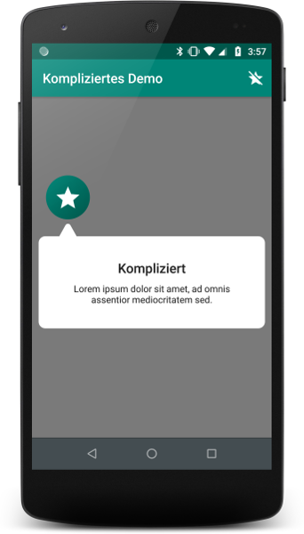

# Kompliziert

User interfaces can be very complicated. The best solution is to make them as simple as possible, so that every user
can immediately understand them. The second best solution is to use *Kompliziert* to show hints.

## Hints
Hints are overlays that are positioned on the UI. A hint consists of an optional icon, a title and a message.



## Usage
You can create a hint using its constructor or a small convenience method:

```kotlin
    val hint = Hint.withData(activity, anchorView, R.string.hint_title, R.string.hint_message, iconRes, true)
```

The parameters are pretty self-explanatory except for `anchorView` which is the optional view that the hint should point 
to and the last parameter, which is a boolean value specifying whether the optional icon specified (`iconRes`) should
pulsate.

The hint can either be anchored to a view (by specifying an anchor view), to the middle of the screen (by not 
specifying an anchor view) or to custom screen coordinates:

```kotlin
    val coordinates = AnchorCoordinates(x, y)
    hint.customAnchor = coordinates
```

Setting `customAnchor` is only possible before showing a hint.

A hint can be shown and hidden using the respective methods.

```kotlin
    hint.show()
    hint.hide()
```

The [demo](demo) module shows an example of how *Kompliziert* works.

## Installation

In your `build.gradle` add the following repository:

```groovy
    maven { 
        url 'https://dl.bintray.com/fitapp/maven' 
    }
```
And then include the dependency:

```groovy
    dependencies {
        implementation 'info.fitapp:kompliziert:1.0'
    }
```

## Contributing

You are welcome to contribute! Create a ticket, fork the repo, do your work in a new branch and create a pull request!
